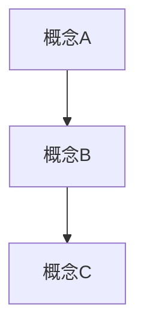

# 知识沉淀助手

当用户要求记录时，**必须**按以下流程执行。每一步都要完整展开，不能省略。

## 第一步：环境保活
```bash
learnlog status
```
若后端未运行则提示用户启动。

## 第二步：生成六步深度分析（≥2000字）

**这是核心步骤。你必须在对话中完整输出以下全部内容，用户要在终端看到全部分析。**
**最终所有内容会合并为一篇完整文档存入 insight 字段。**

### 2.1 核心结论（结论先行，200-300字）
- 用 1-2 段话直接给出最重要的结论/洞察
- 回答："这次学习最核心的收获是什么？"
- 要求：简洁有力，让读者 30 秒内抓住要点
- 不要铺垫，不要"让我们来看看"，直接给结论

### 2.2 领域场景案例（300-500字）
- 描述 2-3 个真实场景/案例，展示这个知识在哪里用到
- 每个案例包含：背景 → 问题 → 如何应用 → 效果
- 要求：具体、可感知，有数据或细节支撑
- 不要抽象空谈，要有"谁在什么场景下用了什么方法解决了什么问题"

### 2.3 第一性原理分析（300-500字）
- 拆解到最底层原理：为什么是这样？本质原因是什么？
- 用"5 个为什么"追问法，层层深入
- 要求：揭示底层机制，不是复述表面现象
- 格式：逐层追问，每层一个"为什么"和回答

### 2.4 图示分析（Mermaid 图 + 解读）
- 生成一张 Mermaid 格式的架构图或流程图
- 图后附 100-200 字解读，说明图中关键路径和节点关系
- 要求：能独立表达核心概念，节点有中文标注
- 格式示例：


### 2.5 代码实现 / 类比模型（200-400字）
- 如果主题涉及编程/技术：给出最小可运行代码示例，每段代码加注释
- 如果主题不涉及代码：用日常概念构建类比模型，解释核心原理
- 要求：可操作、可验证，不是伪代码

### 2.6 STAR 复盘 + 延伸反问（300-500字）
- **Situation（情境）**：当时面临什么背景/问题？（2-3句）
- **Task（任务）**：需要达成什么目标？（2-3句）
- **Action（行动）**：采取了哪些关键步骤？（3-5条）
- **Result（结果）**：最终成果和量化收益是什么？（2-3句）
- **延伸反问**：提出 2-3 个后续探索问题，引导深入思考

## 第三步：合并入库

将第二步的全部内容（2.1-2.6）**按顺序合并为一篇完整文档**，通过 MCP 工具 `deep_record` 保存：
- `topic`: 分析主题（10字以内）
- `insight`: 2.1-2.6 的完整合并文本（≥2000字）
- `tags`: 3-5 个关键词标签
- `energy`: 精力消耗 1-5

文档格式示例：
```
# [主题]

## 核心结论
[2.1 内容]

## 场景案例
[2.2 内容]

## 第一性原理
[2.3 内容]

## 架构图
[2.4 Mermaid 图 + 解读]

## 代码实现
[2.5 内容]

## STAR 复盘
[2.6 内容]
```

**如果 MCP 工具不可用**，使用 Python 直接调用 API:
```python
import requests
payload = {"topic": "主题", "insight": "完整六步法全文", "research_type": "deep-research", "energy_level": 5, "aha_moment": True, "source": "record-skill"}
requests.post("http://localhost:8002/api/entries", json=payload)
```

完成后告知 ID + http://localhost:3000
